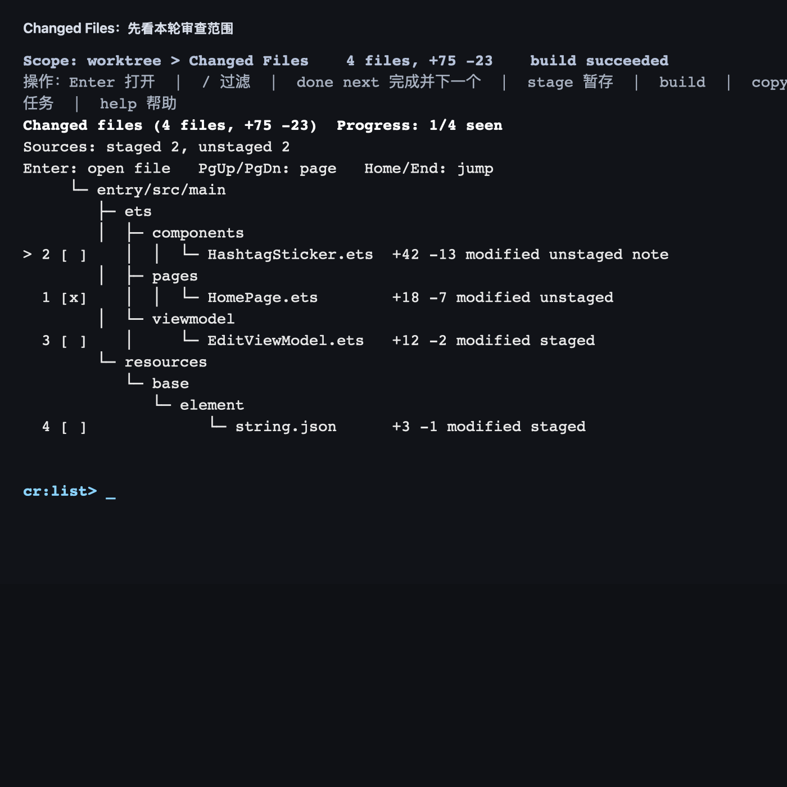
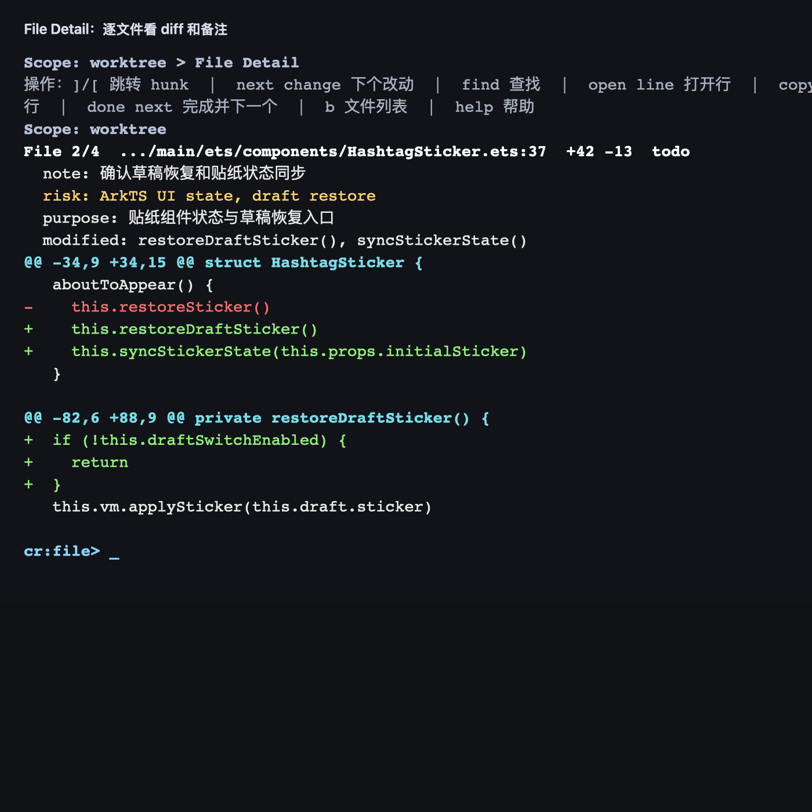
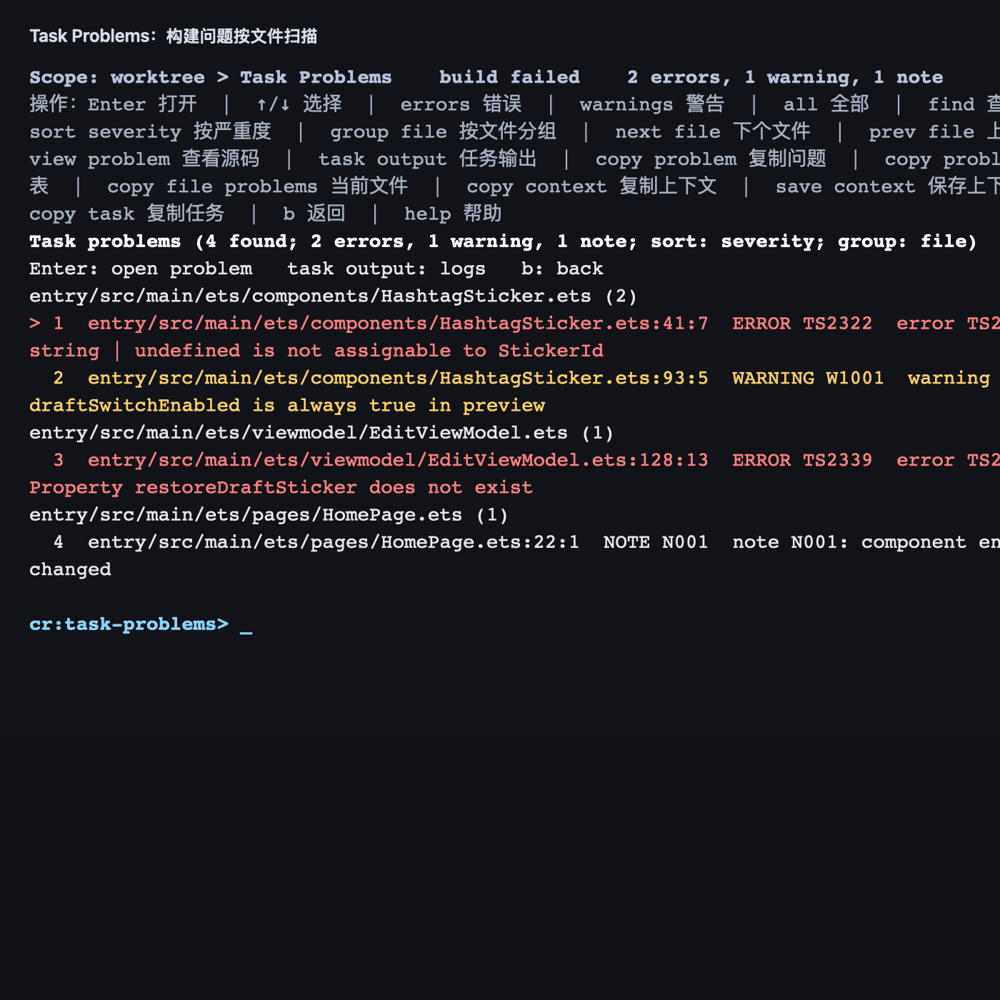
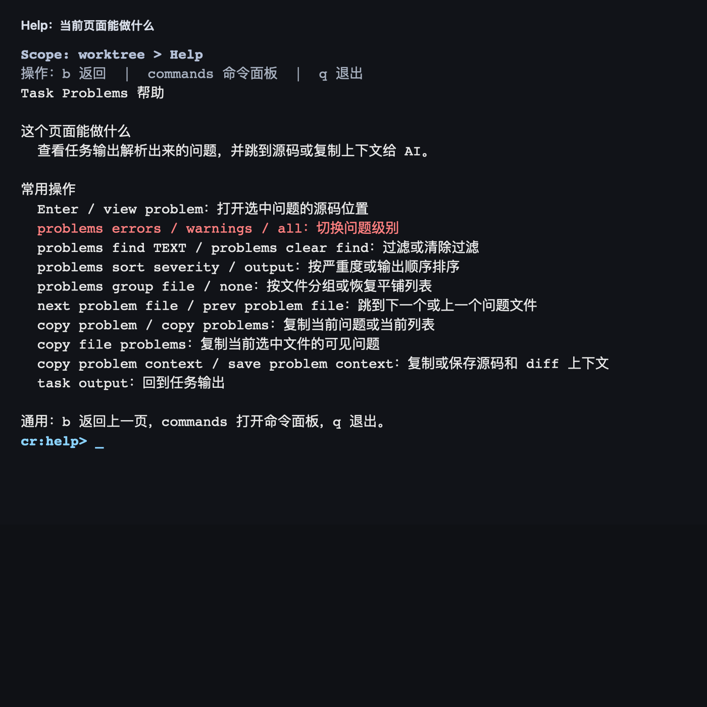

# cr 使用指南

`cr` 是一个运行在终端里的代码工作台。它现在的定位不是“git diff 的包装器”，而是一个轻量 TUI，用来承接日常 IDE 里最频繁的动作：看本轮改动、逐文件 review、切 commit、跑 build/test/lint、查看构建问题、打开源码、复制上下文给 AI 或同事。

长期目标很直接：让你在一个固定、不乱刷屏的终端界面里完成大部分代码工作。

## 1. 快速开始

进入任意 Git 仓库后运行：

```bash
cr
```

如果还没有安装入口，可以在本项目源码里运行：

```bash
cd /Users/bytedance/Documents/Codex/arkts-cr
PYTHONPATH=src python3 -m cr
```

安装为命令：

```bash
python3 -m pip install --user -e .
cr --help
```

如果 shell 提示 `cr: command not found`，把 Python 用户脚本目录加到 `PATH`：

```bash
export PATH="$(python3 -m site --user-base)/bin:$PATH"
```

## 2. 产品模型

`cr` 的主线层级是：

```text
Review Scope -> Changed Files -> File Detail
```

意思是：

1. 先决定这次看什么：工作区、暂存区、全部本地改动、某个 commit、某个 range。
2. 再看这批改动里有哪些文件。
3. 最后进入单个文件，看 diff、跳 hunk、写备注、复制上下文。

旁边还有几个辅助页面：

```text
Command Palette    命令面板
Task Output        完整 build/test/lint 输出
Task Problems      从任务输出解析出来的问题列表
Source File        从问题跳进源码预览
Help               当前页面帮助
```

界面采用固定 browser frame，而不是普通 stdout 日志流：

```text
上下文区        当前 scope、状态反馈、临时提示
主工作区        文件树、commit 列表、单文件 diff、Problems、Help
后台任务面板    build/test/lint 的状态和最近输出
命令提示区      cr:list> / cr:file> / cr:task-problems> / ...
```

所以 build 运行时不会把文件列表和命令输入刷乱。普通页面只刷新底部任务面板；需要看完整日志时再进入 `task output`。

## 3. 界面导览

### Changed Files：先看本轮改动范围



文件列表会按目录树展示改动。你可以看到：

- 当前 scope，比如 `worktree`、`staged`、`all`、`commit`。
- 本轮文件数和增删行数。
- staged / unstaged 来源。
- review 进度，比如 `Progress: 1/4 seen`。
- 文件前面的 `[x]` / `[ ]`，表示已看或待看。
- 文件级 note 标记。

常用动作：

```text
↑/↓ 或 j/k       移动选择
Enter            打开当前文件
/                按路径过滤
m                标记当前文件已看
done next        标记已看并进入下一个文件
remaining        只看未完成文件
allfiles         回到全部文件
g                打开最近 commit 列表
scopes           打开 Review Scope 首页
```

### File Detail：逐文件看 diff 和备注



进入文件后，页面会显示：

- 文件序号和路径。
- 首个改动行 anchor。
- 文件增删行数和 seen/todo 状态。
- 文件 note。
- 风险提示、文件用途、改动符号。
- diff hunk。
- 底部 changed-file 队列，显示当前文件附近的文件、seen/todo、note、来源和增删行。

常用动作：

```text
↑/↓ 或 j/k       滚动当前文件
] / [            下一个 / 上一个 hunk
next change      下一条真实 + 或 - 改动行
prev change      上一条真实 + 或 - 改动行
find TEXT        在当前文件详情里查找
next match       下一个查找匹配
prev match       上一个查找匹配
open line        用编辑器打开当前渲染行
copy line        复制当前行锚点
copy hunk        复制当前 hunk
copy change      复制当前改动行上下文
note TEXT        给当前文件写备注
note change TEXT 给当前改动行追加备注
b                返回文件列表
```

### Task Output：查看和交接构建日志

运行 `build`、`test` 或 `lint` 后，输入 `task output` 可以打开完整任务输出页。底部任务面板只保留最近几行，Task Output 页用于需要认真看日志的时候。

常用动作：

```text
task output              打开当前任务输出
find TEXT                在任务输出里查找
next match               下一个匹配
problems                 从输出进入 Problems 页
view problem             直接查看首个解析出的问题源码
copy problem context     复制首个问题 + 源码 + diff 上下文
save problem context     保存首个问题 + 源码 + diff 上下文
copy task                复制完整任务输出
copy task tail           复制最后 40 行任务输出
copy task tail 80        复制最后 80 行任务输出
save task                保存完整任务输出
save task tail           保存最后 40 行到 .cr/handoff/task-output-tail.md
```

### Task Problems：按文件扫描构建问题



运行 `build`、`test` 或 `lint` 后，可以进入 Problems 页查看从输出中解析出来的 `path:line[:column]` 问题。Problems 页支持按严重度过滤、文本查找、按文件分组，以及文件级跳转。

常用动作：

```text
problems                 打开 Problems 页
problems errors          只看错误
problems warnings        只看警告
problems all             清除严重度过滤
problems find TEXT       按路径、位置、summary、severity、code、message 查找
problems clear find      清除文本过滤
problems sort severity   按 error/warning/info/note 排序
problems sort output     恢复任务输出顺序
problems group file      按文件分组
problems group none      恢复平铺
next problem file        跳到下一个问题文件
prev problem file        跳到上一个问题文件
view problem             在 TUI 里查看问题附近源码
copy problem             复制当前问题
copy problems            复制当前可见问题列表
copy file problems       复制当前选中文件的可见问题
copy problem context     复制问题、源码片段、同文件 diff 上下文
save problem context     保存同一份上下文
```

### Source File：从问题跳进源码阅读

从 Problems 页执行 `view problem` 后，会进入只读 Source File 页面。这里用于看问题附近源码，不要求文件一定在当前 changed files 里。

页面顶部会显示当前源码行的阅读上下文：

- `context: N`：复制源码时包含的上下文行数。
- `selection: A-B`：当前选中的源码范围。
- `mark: N`：用于 `source select to` 的临时标记。
- `symbol: ...`：当前行所在的 class / struct / function / method，基于轻量 outline 推断。

常用动作：

```text
find TEXT            在源码预览里查找
copy line            复制当前源码行锚点
copy source          复制当前源码上下文，包含 symbol 提示
source context N     设置复制源码的上下文行数
source mark          标记当前源码行
source select to     选择标记行到当前行
source select A B    选择指定源码范围
source select symbol 选择当前函数或方法范围
copy problem context 复制问题 + 源码 + diff 上下文
```

### Help：每个页面都有中文帮助



在任何页面输入：

```text
help
```

会打开当前页面的中文帮助。它只展示这个页面当前能做什么，不要求你记住所有命令。也可以输入：

```text
commands
```

打开完整命令面板。

## 4. 一条典型工作流

```text
cr
  -> 在 Changed Files 看本轮改动
  -> Enter 进入某个文件
  -> ] / [ 在 hunk 间跳
  -> note change TEXT 给关键改动做备注
  -> build 跑编译
  -> problems 查看错误
  -> problems group file 按文件分组
  -> view problem 跳进源码预览
  -> copy problem context 复制问题 + 源码 + diff 给 AI
  -> b 返回继续 review
```

如果你只想看当前文件相关的构建问题：

```text
problems
problems group file
copy file problems
```

如果你想快速扫一遍大型构建输出：

```text
problems sort severity
problems group file
next problem file
prev problem file
```

## 5. Review Scope：切换审查范围

在 `cr` 里输入以下命令可以切换当前 scope：

```text
worktree          查看未暂存工作区改动
staged            查看暂存区改动
all               查看 staged + unstaged 的本地改动
base main         查看当前工作区/HEAD 相对 main 的改动
range main..HEAD  查看两个 ref 之间的改动
g                 查看最近 commit 列表
w                 回到工作区改动
```

当工作区没有未提交改动，或者当前改动都已经暂存时，直接运行 `cr` 会显示最近 commit 列表。选中 commit 后进入该 commit 的 changed-file list。`b` 返回上一页，`forward` 前进到刚才离开的页面。

## 6. 任务系统：build / test / lint

常用命令：

```text
build       运行仓库配置的编译命令
test        运行测试
lint        运行 lint
task output 查看完整任务输出
problems    查看解析出来的问题
stop        停止正在运行的任务
rerun       重跑最近一次任务
tasks       查看任务命令来源
tasks help  查看 .cr/tasks.json 格式
```

任务命令解析顺序：

1. CLI 参数，比如 `--build-cmd`。
2. 环境变量，比如 `CR_BUILD_CMD`。
3. 项目内 `.cr/tasks.json`。
4. `DouyinHarmony` 仓默认 build：`./remote buildEntry --app douyin`。
5. 如果都没有，提示缺少命令。

示例：

```bash
cr --build-cmd './remote buildEntry --app douyin' --test-cmd 'npm test' --lint-cmd 'npm run lint'
```

项目内 `.cr/tasks.json` 示例：

```json
{
  "build": "./remote buildEntry --app douyin",
  "test": "npm test",
  "lint": "npm run lint"
}
```

后台任务会放进独立进程组。`stop` / `cancel` 会先温和停止整个任务进程组；短时间内还没退出时，会升级强杀，减少残留子进程继续刷日志。

## 7. 复制、保存和交给 AI

`cr` 很多命令都是为了把当前上下文变成可交付文本：

```text
copy path              复制当前文件路径
copy anchor            复制当前文件 path:line
copy line              复制当前行 path:line
copy diff              复制当前文件轻量 diff 片段
copy hunk              复制当前 hunk
copy change            复制当前改动行
copy prompt            复制当前可见改动的 AI review handoff
copy prompt file       复制当前文件的 AI review handoff
copy notes             复制 review 备注汇总
copy problem           复制当前问题
copy problems          复制当前可见问题列表
copy file problems     复制当前文件的问题列表
copy problem context   复制问题 + 源码 + 同文件 diff
```

保存到文件：

```text
save diff [PATH]
save prompt [PATH]
save prompt file [PATH]
save problem context [PATH]
save task [PATH]
```

默认会写到 `.cr/handoff/` 下，方便贴给聊天、AI、PR comment 或后续脚本处理。

## 8. 文件动作和编辑器

打开编辑器：

```bash
cr --open-cmd 'code -g {fileline}'
```

复制和 reveal：

```bash
cr --copy-cmd 'pbcopy' --reveal-cmd 'open -R {file}'
```

环境变量：

```bash
export CR_COPY_CMD='pbcopy'
export CR_REVEAL_CMD='open -R {file}'
```

常用文件动作：

```text
open         打开当前文件到首个改动行
open hunk    打开当前 diff hunk
open line    打开当前渲染行
reveal       在文件管理器里定位当前文件
file actions 查看 open/copy/reveal 命令来源
```

## 9. Source File Page：从问题跳进源码

在 Problems 页输入：

```text
view problem
```

会进入只读源码预览页。这里不是 File Detail，它不要求该文件一定在本轮 changed files 里；它用于从构建错误跳到源码附近。

常用动作：

```text
find TEXT
next match
prev match
copy line
source context N
source select START END
source select symbol
source mark
source select to
source clear mark
source clear selection
copy source
copy problem context
save problem context
```

`copy source` 有两种模式：

- 没有选区时，复制目标行附近上下文。
- 有 `source select`、`source mark` 或 `source select symbol` 选区时，只复制选中的源码范围。

## 10. Review 进度和备注

```text
m / seen / done        标记当前文件已看
done next / seen next  标记已看并移动到下个文件
todo / unseen / unmark 取消已看标记
remaining              只看未看文件
allfiles               回到全部文件
note TEXT              给当前文件写备注
note change TEXT       给当前改动行追加备注
notes                  显示全部备注
notes QUERY            过滤备注
copy notes             复制备注汇总
copy notes QUERY       复制过滤后的备注汇总
```

`cr` 会在退出时保存当前 workspace 状态到：

```text
.git/cr/browse-state.json
```

包括当前 scope、filter、选中文件、页面层级、review 进度和 per-file note。下次直接运行 `cr` 会恢复。

显式传入 `--staged`、`--all`、`--base`、`--range`、`--untracked` 或路径参数时，本次命令优先，不会被历史状态覆盖。

## 11. 常用启动参数

```bash
cr --code              只看代码文件
cr --sort risk         按风险排序
cr --sort churn        按改动量排序
cr --untracked         包含未跟踪文件
cr --context 0         调小 diff 上下文
cr --staged            只看暂存区
cr --all               看 staged + unstaged
cr --base main         看相对 main 的改动
cr --range main..HEAD  看两个 ref 之间的改动
```

## 12. 行模式

如果终端不支持 raw-key TUI，`cr` 会退回行模式。行模式仍然可以输入核心命令：

```text
/Second
filter Second
clear
commands
scopes
m
remaining
allfiles
todo
g
1
q
```

行模式体验不如完整 TUI，但可以作为兼容 fallback。

## 13. 当前能力概览

| 模块 | 已支持 |
| --- | --- |
| Review Scope | worktree、staged、all、base、range、recent commits、单 commit 查看 |
| Changed Files | 文件树、过滤、来源标记、seen/todo、remaining、note、刷新保留位置 |
| File Detail | diff 浏览、底部文件队列、hunk 跳转、改动行跳转、查找、打开编辑器、复制 hunk/change/line |
| Command Palette | 命令浏览、搜索、执行、中文分组说明 |
| Help | 每个页面中文帮助 |
| Task Panel | build/test/lint、底部日志面板、任务历史、停止/重跑 |
| Task Output | 完整日志页、滚动、查找、复制/保存日志 |
| Task Problems | 诊断提取、severity filter、text filter、severity sort、file grouping、file jumps、problem/context copy |
| Source File | 从问题看源码、源码内查找、复制源码上下文、精确选区、mark-to-select |
| Handoff | copy/save diff、prompt、notes、task output、problem context |

## 14. 设计文档

产品目标、产品层级和架构边界见：

- [docs/product-goal.md](docs/product-goal.md)
- [docs/workbench-navigation.md](docs/workbench-navigation.md)
- [docs/design.md](docs/design.md)
- [docs/p0.md](docs/p0.md)
